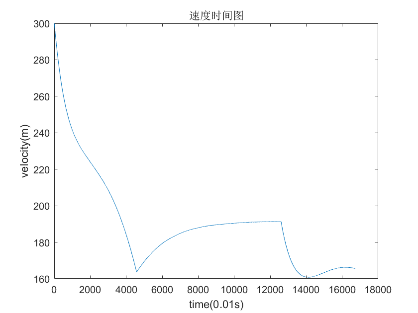

# 方案飞行大作业

> 魏鳞隐 FT042201 2022300766


## 初始条件

导弹质量$ m_0=300kg $

转动惯量$ J_z=350kg \cdot m^2 $

发动机推力$ P=2000N $

质量秒消耗量$ m_s=0.46kg/s $

初始位置$ x_0=0 $

初始高度$ H_0=7000m $

初始弹道倾角$ \theta=0\degree $

初始俯仰角$ \varphi_0=0\degree $

初始攻角$ \alpha=0\degree $

初始俯仰角速度$ \dot \varphi_0=0 $

初始速度$ V_0=300m/s $

参考面积$ S_{ref}=0.45m^2 $

参考长度$ L_{ref}=2.5m $

升力系数$ C_y=0.25\alpha + 0.05\delta_z $(角度单位为度)

阻力系数$ C_x=0.2 + 0.005\alpha^2 $(角度单位为度)

俯仰力矩系数$ m_z=-0.1\alpha + 0.024\delta_z $(角度单位为度)

阻尼力矩系数$ m_z^{\omega_z}=-2 $(角速度单位rad/s)

升力$ Y=C_yqS_{ref} $

阻力$ X=C_xqS_{ref} $

俯仰力矩$ M_z=m_zqS_{ref}L_{ref} $

动压$ q=\frac{1}{2}\rho V^2 $

大气密度计算公式：
$$
\rho_0=1.2495 \\
T_0=288.15 \\
T=T_0-0.0065H \\
\rho=\rho_0(\frac{T}{T_0})^{4.25588}
$$


## 运动方程构建

### 1）飞行方案$ x<9100m $

给定飞行方案
$$
\left\{
\begin{array}{c}
H^*=2000cos(0.000314\cdot1.1x)+5000 \\
m_s=0 \\
\end{array}
\right.
\tag{1}
$$
瞬时平衡假设
$$
\left\{
\begin{array}{c}
m_z^\alpha \alpha+m_z^{\delta_z}\delta_z=0 \\
J=0 \\
\delta_z= k_H(H^*-H)+k_{\dot H}(\dot H^*- \dot H)
\end{array}
\right.
\tag{2}
$$
纵向平面飞行


$$
\left\{
\begin{array}{c}

m\frac{dV}{dt}=Pcos\alpha - X -mgsin\theta \\
mV\frac{d\theta}{dt}=Psin\alpha+Y-mgcos\theta \\
\frac{dm}{dt}=-m_s \\
\frac{dx}{dt}=Vcos\theta \\
\frac{dy}{dt}=Vsin\theta \\
\dot \varphi =\omega_z \\
\theta= \varphi-\alpha \\
\varepsilon_1=0 \\
\varepsilon_4=0
\end{array}
\right.
\tag{3}
$$
将$ (1)(2) $和初始条件与$ (3) $联立得
$$
\left\{
\begin{array}{c}
H^*=2000cos(0.000314\cdot1.1x)+5000 \\
\delta_z= k_H(H^*-H)+k_{\dot H}(\dot H^*- \dot H) \\
C_x=0.2 + 0.005\alpha^2 \\
C_y=0.25\alpha + 0.05\delta_z \\
\rho_0=1.2495 \\
T_0=288.15 \\
T=T_0-0.0065H \\
\rho=\rho_0(\frac{T}{T_0})^{4.25588} \\
q=\frac{1}{2}\rho V^2 \\
X=C_xqS_{ref} \\
Y=C_yqS_{ref} \\
P=0 \\
\frac{dV}{dt}=\frac{Pcos\alpha}{m} - \frac{X}{m} -gsin\theta \\
\frac{d\theta}{dt}=\frac{Psin\alpha+Y-mgcos\theta}{mV} \\
\frac{dm}{dt}=0 \\
\frac{dx}{dt}=Vcos\theta \\
\frac{dy}{dt}=Vsin\theta \\
m_z^{\delta_z}= 0.024 \\
m_z^\alpha=-0.1 \\
\alpha=-\frac{m_z^{\delta_z}}{m_z^\alpha}\delta_z \\
\end{array}
\right.
\tag{4}
$$


### 2）飞行方案 $ 9100m<x<24000m $

给定飞行方案
$$
\left\{
\begin{array}{c}
H^*=3050 m \\
m_s=0.46 kg/s \\
\end{array}
\right.
\tag{5}
$$
瞬时平衡假设
$$
\left\{
\begin{array}{c}
m_z^\alpha \alpha+m_z^{\delta_z}\delta_z=0 \\
J=0 \\
\delta_z= k_H(H^*-H)+k_{\dot H} \dot H)
\end{array}
\right.
\tag{6}
$$
纵向平面飞行


$$
\left\{
\begin{array}{c}

m\frac{dV}{dt}=Pcos\alpha - X -mgsin\theta \\
mV\frac{d\theta}{dt}=Psin\alpha+Y-mgcos\theta \\
\frac{dm}{dt}=-m_s \\
\frac{dx}{dt}=Vcos\theta \\
\frac{dy}{dt}=Vsin\theta \\
\dot \varphi =\omega_z \\
\theta= \varphi-\alpha \\
\varepsilon_1=0 \\
\varepsilon_4=0
\end{array}
\right.
\tag{7}
$$
将$ (5)(6) $和初始条件与$ (7) $联立得
$$
\left\{
\begin{array}{c}
H^*=5000 \\
\delta_z= k_H(H^*-H)+k_{\dot H} \dot H \\
C_x=0.2 + 0.005\alpha^2 (degree)\\
C_y=0.25\alpha + 0.05\delta_z (degree)\\
\rho_0=1.2495 \\
T_0=288.15 \\
T=T_0-0.0065H \\
\rho=\rho_0(\frac{T}{T_0})^{4.25588} \\
q=\frac{1}{2}\rho V^2 \\
X=C_xqS_{ref} \\
Y=C_yqS_{ref} \\
P=2000 \\
\frac{dV}{dt}=\frac{Pcos\alpha}{m} - \frac{X}{m} -gsin\theta \\
\frac{d\theta}{dt}=\frac{Psin\alpha+Y-mgcos\theta}{mV} \\
\frac{dm}{dt}=-0.46 \\
\frac{dx}{dt}=Vcos\theta \\
\frac{dy}{dt}=Vsin\theta \\
m_z^{\delta_z}= 0.024 \\
m_z^\alpha=-0.1 \\
\alpha=-\frac{m_z^{\delta_z}}{m_z^\alpha}\delta_z \\
\end{array}
\right.
\tag{8}
$$

### 3）飞行方案$ x>24000m , y>0 $

目标位置为
$$
\left\{
\begin{array}{c}
x_T=30000m \\
y_T=0
\end{array}
\right.
\tag{9}
$$
采用比例导引法
$$
\left\{
\begin{array}{c}
r\frac{dq}{dt} = V_m sin\eta - V_T sin\eta_T \\
tan q=\frac{y_T-y_m}{x_T-x_m} \\
\frac{d\theta^*}{dt}=k \frac{dq}{dt} \\
\theta^*-\theta_0=k(q-q_0)
\end{array}
\right.
\tag{10}
$$
纵向平面飞行


$$
\left\{
\begin{array}{c}

m\frac{dV}{dt}=Pcos\alpha - X -mgsin\theta \\
mV\frac{d\theta}{dt}=Psin\alpha+Y-mgcos\theta \\
\frac{dm}{dt}=-m_s \\
\frac{dx}{dt}=Vcos\theta \\
\frac{dy}{dt}=Vsin\theta \\
\dot \varphi =\omega_z \\
\theta= \varphi-\alpha \\
\varepsilon_1=0 \\
\varepsilon_4=0
\end{array}
\right.
\tag{11}
$$
瞬时平衡假设
$$
\left\{
\begin{array}{c}
m_z^\alpha \alpha+m_z^{\delta_z}\delta_z=0 \\
J=0 \\
\theta=\theta^*
\end{array}
\right.
\tag{12}
$$
发动机关闭
$$
\left\{
\begin{array}{c}
P=0 \\
m_s=0
\end{array}
\right.
\tag{13}
$$
将$ (9)(10)(12)(13) $和初始条件与$ (11) $联立得
$$
\left\{
\begin{array}{c}
C_x=0.2 + 0.005\alpha^2 (degree)\\
C_y=0.25\alpha + 0.05\delta_z (degree)\\
\rho_0=1.2495 \\
T_0=288.15 \\
T=T_0-0.0065H \\
\rho=\rho_0(\frac{T}{T_0})^{4.25588} \\
q=\frac{1}{2}\rho V^2 \\
X=C_xqS_{ref} \\
Y=C_yqS_{ref} \\
P=0 \\
\frac{dV}{dt}=\frac{Pcos\alpha}{m} - \frac{X}{m} -gsin\theta \\
q_1=arctan\frac{y_T-y_m}{x_T-x_m} \\
\eta=q_1-\theta \\
\frac{dq}{dt} =  \frac{sin\eta}{r} \\
\frac{d\theta^*}{dt}=k \frac{dq_1}{dt} \\
\theta^*=\theta_0 + k(q_1-q_0) \\
\frac{d\theta}{dt}=\frac{d\theta^*}{dt} \\
\theta = \theta^* \\
\alpha = \frac{\pi}{180}(\frac{mV\frac{d\theta}{dt}+mgcos\theta}{0.25qS_{ref}})-0.05\delta_z \\
\frac{dm}{dt}=0 \\
\frac{dx}{dt}=Vcos\theta \\
\frac{dy}{dt}=Vsin\theta \\
m_z^{\delta_z}= 0.024 \\
m_z^\alpha=-0.1 \\
\delta_z = -\frac{m^\alpha_z}{m^{\delta_z}_z}\alpha \\
\end{array}
\right.
\tag{14}
$$

## 结果计算

 



## matlab源码

仓库地址:https://github.com/weilinyin/planed-fly

``` matlab
y1 = plan1([300; 0; 0; 7000; 0; 0 ;7000; 300]);
y2 = plan2(y1(:,end));
y3 = plan3(y2(:,end));
figure;
plot([y1(3,:),y2(3,:),y3(3,:)],[y1(4,:),y2(4,:),y3(4,:)]);
xlabel('x(m)');
ylabel('y(m)');
title('弹道轨迹图');
figure;
plot([y1(1,:),y2(1,:),y3(1,:)]);
xlabel('time(0.01s)');
ylabel('velocity(m)');
title('速度时间图');

function q = dynamic_pressure(height, velocity)
    %动压计算，输入高度，速度，输出动压

    rho_0 = 1.2495;
    T_0 = 288.15;
    T = T_0 - 0.0065*height;
    rho = rho_0 * (T/T_0)^4.25588;
    q = 0.5 * rho * velocity^2;
end

function y=plan1(init_conditions)
% [V; theta; x; y; delta_z; alpha; H*; mass]
%
    % 定义参数
    k_H = 1; % 示例值
    k_dot_H = 1; % 示例值
    S_ref = 0.45;  
    g = 9.81; 
    P = 0; 
    

    %步长
    dt=0.01;

    % 求解
    y = zeros(8, 4579);
    y(:,1) = init_conditions;
    dydt = zeros(8, 1);
    i=1;
    while(y(3,i)<9100 && y(1,i)>0)
        C_x = 0.2 + 0.005 * rad2deg(y(6,i))^2;
        C_y = 0.25 * rad2deg(y(6,i)) + 0.05 * rad2deg(y(5,i));
        q = dynamic_pressure(y(4,i), y(1,i));

        X = C_x * q * S_ref; 
        Y = C_y * q * S_ref; 

        dydt(1) = (P * cos(y(6,i)) ) / y(8,i) - X / y(8,i) - g * sin(y(2,i)); %V
        dydt(2) = (P * sin(y(6,i)) + Y - y(8,i) * g * cos(y(2,i)-y(6,i))) / (y(8,i) * y(1,i)); %theta 
        dydt(3) = y(1,i) * cos(y(2,i)); % dx/dt
        dydt(4) = y(1,i) * sin(y(2,i)); % dy/dt
        y(7,i+1) = 2000 * cos(0.000314 * 1.1 * y(3,i)) + 5000; %H*
        y(5,i+1) = k_H * (y(7,i) - y(4,i)) + k_dot_H * (y(7,i+1)-y(7,i)-dydt(4)) ; %delta_z
        if y(5,i+1)>deg2rad(15)
            y(5,i+1) = deg2rad(15);
        elseif y(5,i+1)<-deg2rad(15)
            y(5,i+1) = -deg2rad(15);
        end
        y(6,i+1) = 0.24 * y(5,i); %alpha
        y(1:4,i+1) = y(1:4,i) + dt*dydt(1:4); %积分
        y(8,i+1)= y(8,i) + dt*dydt(8);
        i=i+1;
    end
end

function y=plan2(init_conditions)
% [V; theta; x; y; delta_z; alpha; H*; mass]
%
    % 定义参数
    k_H = 1; % 示例值
    k_dot_H = -10; % 示例值
    S_ref = 0.45; 
    g = 9.81; 
    P = 2000; 
    

    %步长
    dt=0.01;

    % 求解
    y = zeros(8, 8026);
    y(:,1) = init_conditions;
    dydt = zeros(8, 1);
    i=1;
    while(y(3,i)<24000 && y(1,i)>0)
        C_x = 0.2 + 0.005 * rad2deg(y(6,i))^2;
        C_y = 0.25 * rad2deg(y(6,i)) + 0.05 * rad2deg(y(5,i));
        q = dynamic_pressure(y(4,i), y(1,i));

        X = C_x * q * S_ref; 
        Y = C_y * q * S_ref; 

        dydt(1) = (P * cos(y(6,i)) ) / y(8,i) - X / y(8,i) - g * sin(y(2,i)); %V
        dydt(2) = (P * sin(y(6,i)) + Y - y(8,i) * g * cos(y(2,i)-y(6,i))) / (y(8,i) * y(1,i)); %theta 
        dydt(3) = y(1,i) * cos(y(2,i)); % dx/dt
        dydt(4) = y(1,i) * sin(y(2,i)); % dy/dt
        y(7,i+1) = 3050; %H*
        y(5,i+1) = k_H * (y(7,i) - y(4,i)) + k_dot_H * dydt(4) ; %delta_z
        dydt(8) = -0.46;
        if y(5,i+1)>deg2rad(15)
            y(5,i+1) = deg2rad(15);
        elseif y(5,i+1)<-deg2rad(15)
            y(5,i+1) = -deg2rad(15);
        end
        y(6,i+1) = 0.24 * y(5,i); %alpha
        y(1:4,i+1) = y(1:4,i) + dt*dydt(1:4); %积分
        y(8,i+1)= y(8,i) + dt*dydt(8);
        i=i+1;
    end
end

function y=plan3(init_conditions)
% [V; theta; x; y; delta_z; alpha; H*; mass]
%
    % 定义参数
    S_ref = 0.45;  
    g = 9.81; 
    P = 0; 
    K = 4;
    x_t=30000;
    y_t=0;

    %步长
    dt=0.01;

    % 求解
    y = zeros(8, 4116);
    y(:,1) = init_conditions;
    dydt = zeros(8, 1);
    i=1;

    while(y(4,i)>0 && sqrt((y(3,i)-x_t)^2+(y(4,i)-y_t)^2)>1 && y(1,i)>0)
        C_x = 0.2 + 0.005 * rad2deg(y(6,i))^2;
        C_y = 0.25 * rad2deg(y(6,i)) + 0.05 * rad2deg(y(5,i));
        q = dynamic_pressure(y(4,i), y(1,i));

        X = C_x * q * S_ref; 
        Y = C_y * q * S_ref; 

        dydt(1) = (P * cos(y(6,i)) ) / y(8,i) - X / y(8,i) - g * sin(y(2,i)); %V
        [~,dydt(2)] = Proportional_Guidance(y(3,i), y(4,i), x_t, y_t, y(1,i), 0, y(2,i), 0, K);%theta 
        dydt(3) = y(1,i) * cos(y(2,i)); % dx/dt
        dydt(4) = y(1,i) * sin(y(2,i)); % dy/dt
        y(6,i+1)=deg2rad((y(8,i) * y(1,i) * dydt(2)+y(8,i) * g * cos(y(2,i)))/(0.25 * q *S_ref))-0.05 * y(5,i);%alpha
        y(5,i+1)=0.1/0.024*y(6,i+1);%delta_z
        if y(5,i+1)>deg2rad(15)
            y(5,i+1) = deg2rad(15);
        elseif y(5,i+1)<-deg2rad(15)
            y(5,i+1) = -deg2rad(15);
        end
        y(1:4,i+1) = y(1:4,i) + dt*dydt(1:4); %积分
        y(8,i+1)= y(8,i) + dt*dydt(8);
        i=i+1;
    end
end

function  [q,dthetadt]=Proportional_Guidance(x_m,y_m,x_t,y_t,v_m,v_t,theta_m,theta_t,K)
    %比例导引法
    %输入[导弹x坐标，导弹y坐标，目标x坐标，目标y坐标，导弹速度，目标速度，导弹theta，目标theta，导航比]
    %输出[视角q，dq/dt，dtheta/dt]
    r=sqrt((x_m-x_t)^2+(y_m-y_t)^2);
    q=atan((y_t-y_m)/(x_t-x_m));
    eta_m=q-theta_m;
    eta_t=q-theta_t;
    dqdt=(v_m*sin(eta_m)-v_t*sin(eta_t))/r;
    dthetadt=K * dqdt;
end
```

